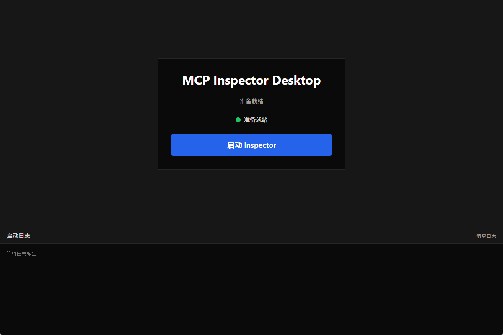
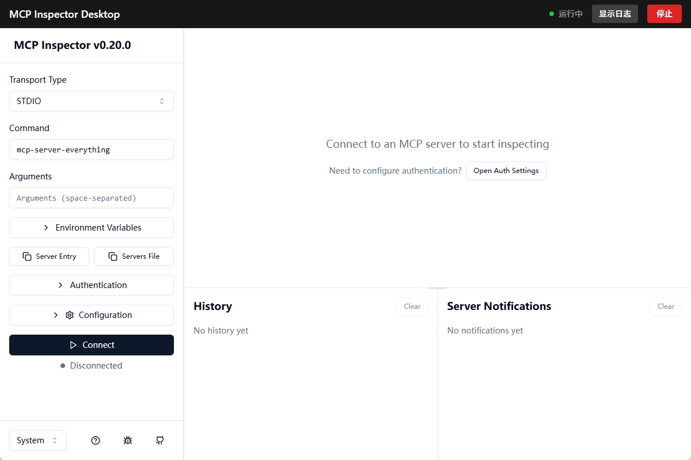

# MCP Inspector Desktop

一个基于 Tauri 的桌面应用程序，为 [MCP Inspector](https://github.com/modelcontextprotocol/inspector) 提供桌面环境体验。


## 功能特性

- **嵌入式 Inspector**：将 MCP Inspector 完整嵌入桌面应用，无需切换到浏览器
- **实时日志监控**：底部日志面板实时显示 Inspector 启动和运行日志
- **一键启动/停止**：简洁的界面，轻松控制 Inspector 进程
- **状态显示**：清晰的状态指示（准备就绪/运行中/已停止）
- **自动端口分配**：智能选择可用端口，避免端口冲突
- **认证令牌处理**：自动捕获并处理 Inspector 认证令牌

## 运行截图

**启动页**



**Inspector 运行界面**



## 前置要求

### 必需依赖

1. **Node.js** (推荐 v18+)
2. **Rust** (1.70+)
3. **系统依赖**：
   - Windows: [WebView2](https://developer.microsoft.com/en-us/microsoft-edge/webview2/)
   - Linux: webkit2gtk-4.1
   - macOS: 无额外依赖

### MCP Inspector

应用需要全局安装 MCP Inspector CLI 工具：

```bash
npm install -g @modelcontextprotocol/inspector
```

应用启动时会自动检测是否安装，如未安装会提示安装命令。


## 使用方法

### 启动应用

1. 双击运行安装后的应用
2. 首次使用，点击 **"启动 Inspector"** 按钮
3. 底部日志面板会显示启动进度
4. 启动成功后，Inspector 界面会自动嵌入应用窗口

### 停止 Inspector

点击右上角的 **"停止"** 按钮即可停止 Inspector 进程。停止后可以重新启动。

### 查看日志

- **启动页面**：日志面板默认展开
- **运行页面**：点击 **"显示日志"** 按钮展开日志面板

日志颜色说明：
- 🔵 **蓝色**：系统消息
- ⚪ **灰色**：标准输出
- 🔴 **红色**：错误输出

## 开发

### 开发模式

```bash
# 启动开发服务器（前端热重载 + 后端自动重新编译）
npm run tauri dev
```

### 项目结构

```
mcp-inspector-desktop/
├── src/                    # React 前端源码
│   ├── components/         # React 组件
│   │   ├── Launcher.tsx    # 启动页面
│   │   └── InspectorView.tsx # Inspector 视图
│   ├── App.tsx             # 主应用组件
│   └── main.tsx            # 入口文件
├── src-tauri/              # Rust 后端源码
│   ├── src/
│   │   ├── commands.rs     # Tauri 命令处理
│   │   ├── inspector/      # Inspector 进程管理
│   │   │   ├── mod.rs      # 模块定义
│   │   │   └── process.rs  # 进程启动和日志捕获
│   │   ├── config.rs       # 配置管理
│   │   ├── state.rs        # 全局状态
│   │   └── lib.rs          # 库入口
│   └── tauri.conf.json     # Tauri 配置
└── package.json
```

### 技术栈

| 层级 | 技术 |
|------|------|
| 前端框架 | React 18.3 |
| 构建工具 | Vite 6.0 |
| 样式方案 | Tailwind CSS 3.4 |
| 后端框架 | Tauri 2.0 |
| 编程语言 | Rust |
| 进程通信 | Tauri Events |
| 端口选择 | portpicker |

### 常用命令

```bash
# 开发模式
npm run tauri dev

# 构建前端
npm run build

# 预览前端
npm run preview

# 构建桌面应用
npm run tauri build

# 构建特定平台
npm run tauri build -- --target x86_64-pc-windows-msvc
```

## 工作原理

1. **进程管理**：Rust 后端通过 `std::process::Command` 启动 `mcp-inspector` CLI 进程
2. **日志捕获**：使用独立线程实时读取 stdout/stderr 并通过 Tauri Events 发送到前端
3. **令牌捕获**：解析 stdout 中的 "Session token:" 行，提取认证令牌
4. **端口分配**：使用 `portpicker` 自动选择可用端口
5. **浏览器阻止**：设置 `MCP_AUTO_OPEN_ENABLED=false` 环境变量防止浏览器自动打开

## 常见问题

### macOS 提示"无法打开，因为无法验证开发者"

由于应用未经过 Apple 公证（notarization），首次打开时 macOS Gatekeeper 会阻止运行。

**解决方法**（任选其一）：

**方法一：通过系统设置（推荐）**

1. 右键点击应用，选择「打开」
2. 在弹出的对话框中点击「打开」
3. 如果仍然无法打开，前往「系统设置」→「隐私与安全性」→ 向下滚动找到安全性部分 → 点击「仍要打开」

**方法二：通过终端移除隔离属性**

```bash
xattr -cr /Applications/MCP\ Inspector\ Desktop.app
```

**方法三：全局允许任何来源的应用**

```bash
sudo spctl --master-disable
```

> ⚠️ 方法三会降低系统安全性，建议仅在自己了解风险的情况下使用，使用后可通过 `sudo spctl --master-enable` 恢复。

### Inspector 无法启动

### Inspector 无法启动

**问题**：点击启动按钮后提示"未检测到 mcp-inspector"

**解决**：运行以下命令安装 MCP Inspector：
```bash
npm install -g @modelcontextprotocol/inspector
```

### Inspector 在浏览器中打开

**问题**：启动后 Inspector 在浏览器中打开而非嵌入应用

**解决**：确保应用设置了 `MCP_AUTO_OPEN_ENABLED=false` 环境变量（已内置）

### 端口冲突

**问题**：启动失败，提示端口已被占用

**解决**：应用会自动选择可用端口，如仍有问题请检查防火墙设置

## 许可证

MIT License

## 致谢

- [MCP Inspector](https://github.com/modelcontextprotocol/inspector) - 原始 CLI 工具
- [Tauri](https://tauri.app/) - 跨平台桌面应用框架
- [React](https://react.dev/) - UI 框架
- [Tailwind CSS](https://tailwindcss.com/) - CSS 框架
